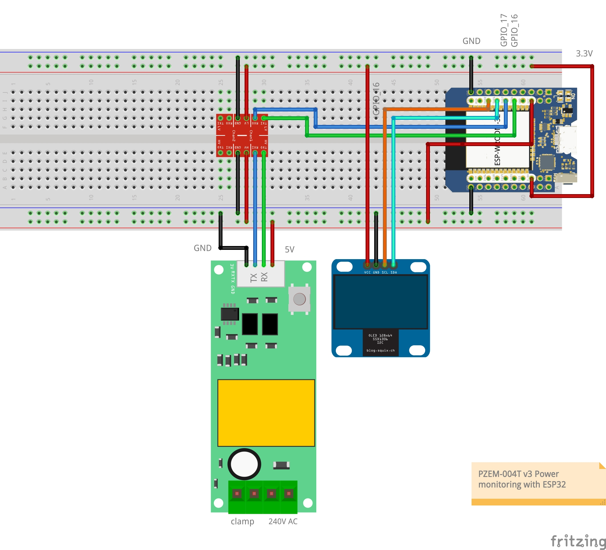

# PZEM-004T v3.0 Power monitoring (ESP-IDF)  
  
 ## Hardware   
PZEM-004T v3.0 Power monitory module (https://innovatorsguru.com/pzem-004t-v3/). 
Can be found on Amazon for approx. 21Euro, I recommend the split core version because it is easier to implement in existing installations.  
Or Aliexpress for lower prices if you have patience.  
  
The PZEM-004T module require 5Volts, the ESP32 mcu requires 3.3Volts so it is recommended to use a level shifter for the serial connection.  
Available on Amazon or Aliexpress or your local store, search for "Level Shifter 3.3v to 5v".  
  
A ESP32 board is required as well, probably any kind of ESP32 base dev board will do but unfortunately I've tried with an Wemos LOLIN ESP32S3 mini board but couldn't get it to work probably due to lack of knowledge on my side, the S3 is a bit different.
In my setup I used a NodeMCU clone alike ESP-WROOM-32 based mini board (MH-ET Live ESP32 MiniKIT to be exact :-) ).  
  

  
## Dependencies
- ESP-IDF Framework https://github.com/espressif/esp-idf/releases/tag/v5.0.2
- Get the esp-protocols components from Espressif
https://github.com/espressif/esp-protocols/

- Add the mDNS components to your root CmakeLists file  
**set(EXTRA_COMPONENT_DIRS "\<Local Path on your HD>/ESP-IDF/esp/esp-protocols/components/mdns")**  

- VSCode + Espressif IDF extension.  
  
  

## Required components
My ported version of the excellent Arduino lib https://github.com/mandulaj/PZEM-004T-v30  
ESP-IDF Edition :-) ===>> pzem-004T v3.0 : https://github.com/wernervanmele/esp-idf-pzem004tv3  

SSD1306 0,96" Oled display component  
https://github.com/nopnop2002/esp-idf-ssd1306  
  
  
Create a "components" folder in the root of the project, checkout the components inside this folder, they'll be automatically detected by the build system, otherwise you have to fiddle with the CMake files.  

## Required Settings  
Run the ESP-IDF configuration editor in vscode or run idf.py menuconfig

Set your board flash size, in my case:  
CONFIG_ESPTOOLPY_FLASHSIZE="4MB"  
  
Set your board CPU Frequency, in my case:  
CONFIG_ESP_DEFAULT_CPU_FREQ_MHZ=240  
  
In case you added the SSD1306 component, select your GPIO pins, in my case:  
CONFIG_SCL_GPIO=22  
CONFIG_SDA_GPIO=21  
CONFIG_RESET_GPIO=-1  
  
For mDNS enable:  
CONFIG_LWIP_DNS_SUPPORT_MDNS_QUERIES=y  

You might want to increase your logging level:  
\# CONFIG_LOG_DEFAULT_LEVEL_NONE is not set  
\# CONFIG_LOG_DEFAULT_LEVEL_ERROR is not set  
\# CONFIG_LOG_DEFAULT_LEVEL_WARN is not set  
CONFIG_LOG_DEFAULT_LEVEL_INFO=y  
\# CONFIG_LOG_DEFAULT_LEVEL_DEBUG is not set  
\# CONFIG_LOG_DEFAULT_LEVEL_VERBOSE is not set  
  
### PZEM-004T v3.0 Serial Configuration  
In the beginning of main.c you can find the ESP UART setup to communicate with the sensor module.  
```c
pzem_setup_t pzConf = {
    .pzem_uart   = UART_NUM_2,       /*  <== Specify the UART you want to use, UART_NUM_0, UART_NUM_1, UART_NUM_2 (ESP32 specific) */
    .pzem_rx_pin = GPIO_NUM_16,      /*  <== GPIO for RX */
    .pzem_tx_pin = GPIO_NUM_17,      /*  <== GPIO for TX */
    .pzem_addr   = PZ_DEFAULT_ADDRESS,   /*  If your module has a different address, specify here or update the variable in pzem004tv3.h */
};
```
Depending on which type of ESP32 module/devkit/board you use the combination of UART and GPIO's might hav eimpact on some functionality ofthe board, check the documentation for the correct information.  
I use a module with a regular ESP32-WROOM-32 chip and a combination of UART wirth GPIO's 16 and 17 works fine.  
  
### MQTT Configuration   
In main.h enable USE_MDNS, via an mDNS request an attempt is odne to discover your mqqt broker on your local network, of this doesn't work a fallback is done to a mqtt url which can be set in **config.h**   
Create in your main folder a header file called credentials.h and define your mqtt user and password of your broker.  
```c
#define MQTT_USER "mqtt-bobby"
#define MQTT_PASS "mqtt-secret-4321"
```

## WiFi  
~~I enforce WIFI_AUTH_WPA3_PSK and forgot to make it configurable (or a bit lazy )~~.  
Various authentication methods and some other parameters are now configurable in **config.h**  
The WiFi SSID and PASSWORD can be set in **credentials.h**  (if the file does not exist please create one)
```c
#define ESP_WIFI_SSID "MY_WIFI_SSID"
#define ESP_WIFI_PASS "WIFI_PASSWORD"
```
  
### Useful ESP-IDF Documentation

mDNS Documentation  
https://docs.espressif.com/projects/esp-protocols/mdns/docs/latest/en/index.html#performance-optimization
https://github.com/espressif/esp-protocols/tree/master/components/mdns/examples  

FreeRTOS  
https://docs.espressif.com/projects/esp-idf/en/latest/esp32/api-reference/system/freertos_idf.html  

Build system cmake  
https://docs.espressif.com/projects/esp-idf/en/latest/esp32/api-guides/build-system.html  

ESP-IDF Style guide  
https://docs.espressif.com/projects/esp-idf/en/latest/esp32/contribute/style-guide.html  
( I use the Astyle extension as mentione din the style guide with the following settings in settings.json)
```json
    "astyle.c.enable": true,
    "astyle.executable": "/opt/homebrew/bin/astyle",
    "[c]": {
        "editor.defaultFormatter": "chiehyu.vscode-astyle"
    },
    "astyle.cmd_options": [
        "--style=otbs",
        "--attach-classes",
        "--indent=spaces=4",
        "--convert-tabs",
        "--align-pointer=name",
        "--align-reference=name",
        "--keep-one-line-statements",
        "--pad-header",
        "--pad-oper",
        "--lineend=linux",
    ],
```

Memory Types
https://docs.espressif.com/projects/esp-idf/en/latest/esp32/api-guides/memory-types.html

Tests showed that using DRAM_ATTR for crcTable[] improved performance from 11 microseconds to 4 microseconds.  Pretty useless in my setup but still amazing.  

Rules for developing safety critical code (NASA)  
https://www.cs.otago.ac.nz/cosc345/resources/nasa-10-rules.pdf  
https://www.cs.otago.ac.nz/cosc345/resources/nasa-10-rules.htm  
